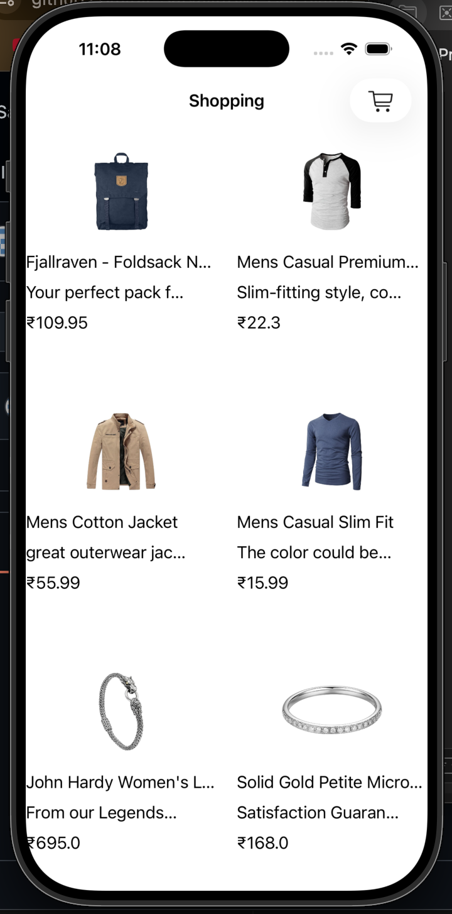
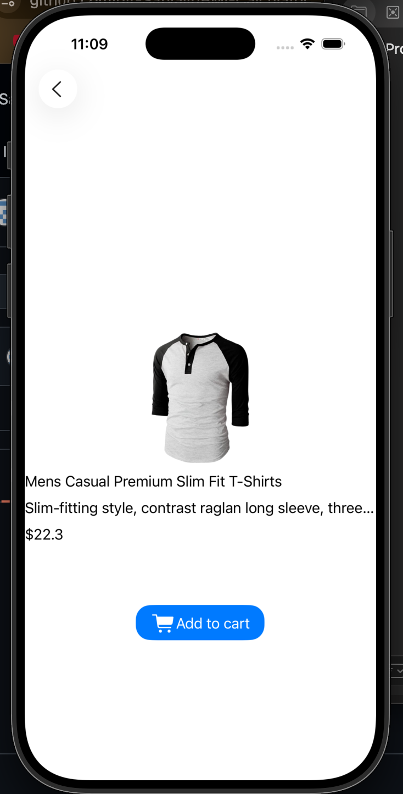
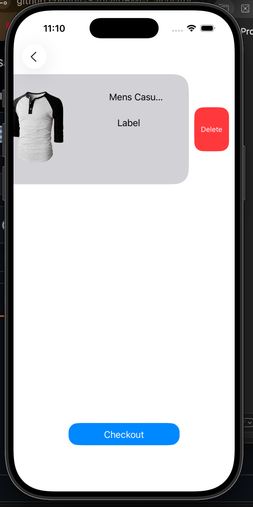
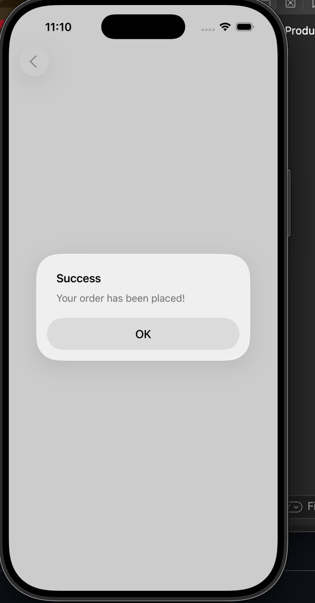

# Shopping App 🛍️


> A dynamic e-commerce iOS application that fetches products from an API, allowing users to browse details, add items to a cart, and proceed to checkout seamlessly.

---

## 📱 Screenshots

| Product List | Product Details | Cart & Checkout | Order Placed |
|:---:|:---:|:---:|:---:|
|  |  |  |  |

---

## ✨ Features

* **Product Browsing:** View a list of products fetched dynamically from a remote API.
* **Detailed View:** Tap on any product to see full descriptions, prices, and images.
* **Shopping Cart:** Add items to your cart and review them before purchase.
* **Checkout Flow:** Simple checkout process with an order confirmation screen.

---

## 🛠 Tech Stack

* **Language:** Swift
* **UI Framework:** UIKit
* **Networking:** URLSession (API Integration)
* **Architecture:** MVC (Model-View-Controller)

---

## 🚀 How to Run

1.  Clone the repository:
    ```bash
    git clone [https://github.com/git-Satyajit/Shopping-App.git](https://github.com/git-Satyajit/Shopping-App.git)
    ```
2.  Open `ProductListApp.xcodeproj` in Xcode.
3.  Build and run on a simulator (e.g., iPhone 15).
